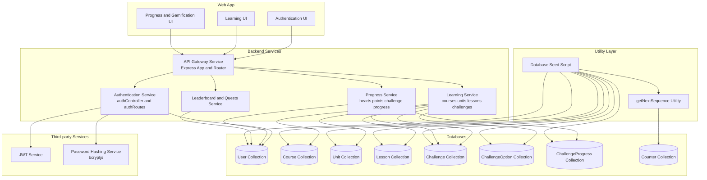
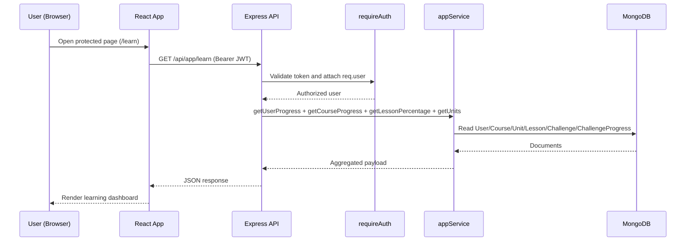

# Duolingo Clone Architecture

## System Architecture (Frontend + Backend + Database)

```mermaid
flowchart TB
    %% Top layer: Web App (matches reference style)
    subgraph WEB_APP[Web App]
        FE_AUTH[Authentication UI]
        FE_LEARN[Learning UI]
        FE_PROGRESS[Progress and Gamification UI]
    end

    %% Middle layer: Backend services
    subgraph BACKEND_SERVICES[Backend Services]
        API_GATEWAY[API Gateway Service<br/>Express App and Router]
        AUTH_SERVICE[Authentication Service<br/>authController and authRoutes]
        LEARNING_SERVICE[Learning Service<br/>courses units lessons challenges]
        PROGRESS_SERVICE[Progress Service<br/>hearts points challenge progress]
        LEADERBOARD_SERVICE[Leaderboard and Quests Service]
    end

    %% Bottom-left layer: Third-party services
    subgraph THIRD_PARTY[Third-party Services]
        JWT_SERVICE[JWT Service]
        HASH_SERVICE[Password Hashing Service<br/>bcryptjs]
    end

    %% Bottom-right layer: Databases
    subgraph DATABASES[Databases]
        USER_DB[(User Collection)]
        COURSE_DB[(Course Collection)]
        UNIT_DB[(Unit Collection)]
        LESSON_DB[(Lesson Collection)]
        CHALLENGE_DB[(Challenge Collection)]
        OPTION_DB[(ChallengeOption Collection)]
        PROGRESS_DB[(ChallengeProgress Collection)]
        COUNTER_DB[(Counter Collection)]
    end

    %% Utility box
    subgraph UTILITIES[Utility Layer]
        ID_SEQUENCE[getNextSequence Utility]
        SEED_SCRIPT[Database Seed Script]
    end

    %% Web app to backend
    FE_AUTH --> API_GATEWAY
    FE_LEARN --> API_GATEWAY
    FE_PROGRESS --> API_GATEWAY

    %% Gateway routing
    API_GATEWAY --> AUTH_SERVICE
    API_GATEWAY --> LEARNING_SERVICE
    API_GATEWAY --> PROGRESS_SERVICE
    API_GATEWAY --> LEADERBOARD_SERVICE

    %% Backend to third-party
    AUTH_SERVICE --> JWT_SERVICE
    AUTH_SERVICE --> HASH_SERVICE

    %% Backend to database
    AUTH_SERVICE --> USER_DB
    LEARNING_SERVICE --> COURSE_DB
    LEARNING_SERVICE --> UNIT_DB
    LEARNING_SERVICE --> LESSON_DB
    LEARNING_SERVICE --> CHALLENGE_DB
    LEARNING_SERVICE --> OPTION_DB
    PROGRESS_SERVICE --> USER_DB
    PROGRESS_SERVICE --> PROGRESS_DB
    PROGRESS_SERVICE --> CHALLENGE_DB
    LEADERBOARD_SERVICE --> USER_DB

    %% Utilities to database
    SEED_SCRIPT --> ID_SEQUENCE
    ID_SEQUENCE --> COUNTER_DB
    SEED_SCRIPT --> USER_DB
    SEED_SCRIPT --> COURSE_DB
    SEED_SCRIPT --> UNIT_DB
    SEED_SCRIPT --> LESSON_DB
    SEED_SCRIPT --> CHALLENGE_DB
    SEED_SCRIPT --> OPTION_DB
    SEED_SCRIPT --> PROGRESS_DB
```

## Runtime Request Flow

```mermaid
sequenceDiagram
	participant U as User (Browser)
	participant FE as React App
	participant API as Express API
	participant AUTH as requireAuth
	participant SRV as appService
	participant DB as MongoDB

	U->>FE: Open protected page (/learn)
	FE->>API: GET /api/app/learn (Bearer JWT)
	API->>AUTH: Validate token and attach req.user
	AUTH-->>API: Authorized user
	API->>SRV: getUserProgress + getCourseProgress + getLessonPercentage + getUnits
	SRV->>DB: Read User/Course/Unit/Lesson/Challenge/ChallengeProgress
	DB-->>SRV: Documents
	SRV-->>API: Aggregated payload
	API-->>FE: JSON response
	FE-->>U: Render learning dashboard
```
