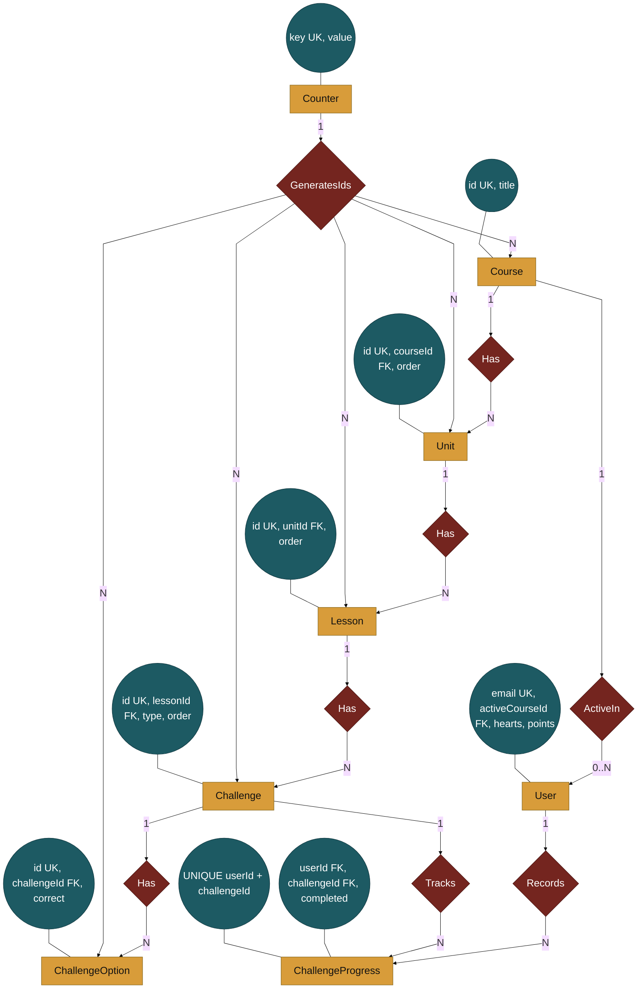

# Duolingo Clone ER Diagram

## Mermaid ER Diagram (Photo Style)

```mermaid
%%{init: {'theme': 'base', 'themeVariables': { 'fontSize': '24px' }, 'flowchart': { 'nodeSpacing': 22, 'rankSpacing': 30, 'curve': 'linear' } }}%%
flowchart TB
    %% Entities
    E_COURSE[Course]
    E_UNIT[Unit]
    E_LESSON[Lesson]
    E_CHALLENGE[Challenge]
    E_OPTION[ChallengeOption]
    E_USER[User]
    E_PROGRESS[ChallengeProgress]
    E_COUNTER[Counter]

    %% Relationships
    R_CU{Has}
    R_UL{Has}
    R_LC{Has}
    R_CO{Has}
    R_UP{Records}
    R_CP{Tracks}
    R_ACTIVE{ActiveIn}
    R_SEQ{GeneratesIds}

    %% Core links with cardinality
    E_COURSE -->|1| R_CU -->|N| E_UNIT
    E_UNIT -->|1| R_UL -->|N| E_LESSON
    E_LESSON -->|1| R_LC -->|N| E_CHALLENGE
    E_CHALLENGE -->|1| R_CO -->|N| E_OPTION

    E_USER -->|1| R_UP -->|N| E_PROGRESS
    E_CHALLENGE -->|1| R_CP -->|N| E_PROGRESS
    E_COURSE -->|1| R_ACTIVE -->|0..N| E_USER

    E_COUNTER -->|1| R_SEQ
    R_SEQ -->|N| E_COURSE
    R_SEQ -->|N| E_UNIT
    R_SEQ -->|N| E_LESSON
    R_SEQ -->|N| E_CHALLENGE
    R_SEQ -->|N| E_OPTION

    %% Compact attribute set (for readability)
    A_COURSE((id UK, title)) --- E_COURSE
    A_UNIT((id UK, courseId FK, order)) --- E_UNIT
    A_LESSON((id UK, unitId FK, order)) --- E_LESSON
    A_CHALLENGE((id UK, lessonId FK, type, order)) --- E_CHALLENGE
    A_OPTION((id UK, challengeId FK, correct)) --- E_OPTION
    A_USER((email UK, activeCourseId FK, hearts, points)) --- E_USER
    A_PROGRESS((userId FK, challengeId FK, completed)) --- E_PROGRESS
    A_PROGRESS_U((UNIQUE userId + challengeId)) --- E_PROGRESS
    A_COUNTER((key UK, value)) --- E_COUNTER

    %% Style similar to your image
    classDef entity fill:#d89c3a,stroke:#8a6a1f,color:#111,stroke-width:1.2px;
    classDef relation fill:#74251f,stroke:#4e1613,color:#fff,stroke-width:1.2px;
    classDef attribute fill:#1d5a63,stroke:#103840,color:#fff,stroke-width:1.2px;

    class E_COURSE,E_UNIT,E_LESSON,E_CHALLENGE,E_OPTION,E_USER,E_PROGRESS,E_COUNTER entity;
    class R_CU,R_UL,R_LC,R_CO,R_UP,R_CP,R_ACTIVE,R_SEQ relation;
    class A_COURSE,A_UNIT,A_LESSON,A_CHALLENGE,A_OPTION,A_USER,A_PROGRESS,A_PROGRESS_U,A_COUNTER attribute;
```
